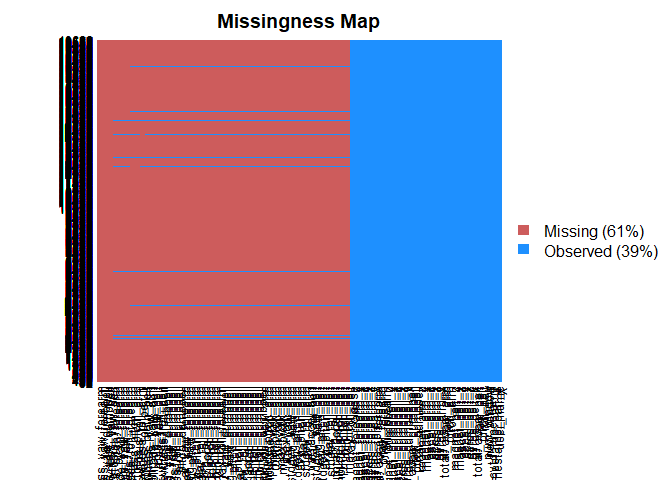
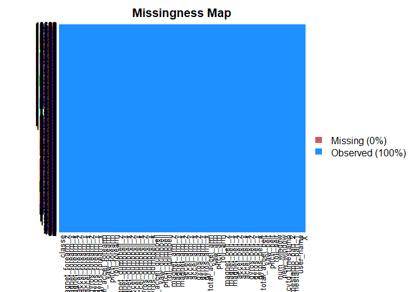

Background
----------

Using devices such as Jawbone Up, Nike FuelBand, and Fitbit it is now possible to collect a large amount of data about personal activity relatively inexpensively. These type of devices are part of the quantified self movement - a group of enthusiasts who take measurements about themselves regularly to improve their health, to find patterns in their behavior, or because they are tech geeks. The goal of this project is to form a machine learning model by using data from accelerometers on the belt, forearm, arm, and dumbell of 6 participants. They were asked to perform barbell lifts correctly and incorrectly in 5 different ways.

Data
----

The training data for this project is obtained from: <https://d396qusza40orc.cloudfront.net/predmachlearn/pml-training.csv> whereas the test data is avaiable here: <https://d396qusza40orc.cloudfront.net/predmachlearn/pml-testing.csv>

The data comes from this source: <http://groupware.les.inf.puc-rio.br/har>

Preliminary Work
----------------

The pseudo-random number generator seed was set at 578.

``` r
library(caret)
```

    ## Loading required package: lattice

    ## Loading required package: ggplot2

``` r
set.seed(578)
```

Loading the data
----------------

We first load the datasets into the environment. Before that, it was discovered that the datasets consists of missing values for some predictors, denoted as "Na".

``` r
if( !file.exists("pml-training.csv")) {download.file(url="https://d396qusza40orc.cloudfront.net/predmachlearn/pml-training.csv",destfile="pml-training.csv")}
 train_raw <- read.csv("pml-training.csv",na.strings = c("NA","#DIV/0!"))
if( !file.exists("pml-testing.csv")) {download.file(url="https://d396qusza40orc.cloudfront.net/predmachlearn/pml-testing.csv",destfile="pml-testing.csv")}
testSet <- read.csv(file="pml-testing.csv",na.strings = c("NA","#DIV/0!"))
```

Data Exploration and Cleaning
-----------------------------

We check the number of variables and number of the observations in the datasets.

``` r
library(Amelia)
```

    ## Loading required package: Rcpp

    ## ## 
    ## ## Amelia II: Multiple Imputation
    ## ## (Version 1.7.5, built: 2018-05-07)
    ## ## Copyright (C) 2005-2018 James Honaker, Gary King and Matthew Blackwell
    ## ## Refer to http://gking.harvard.edu/amelia/ for more information
    ## ##

``` r
dim(train_raw )
```

    ## [1] 19622   160

``` r
dim(testSet)
```

    ## [1]  20 160

``` r
par(mfrow=c(1,2))
missmap(train_raw)
```



We found that there is some colums with all mising values and they should be removed. So we have omitted columns with 90% missing value.

``` r
five<- function(x) sum(!is.na(x))/length(x)
trainSet<-train_raw[,apply(train_raw, 2, five)>0.1]
test<-testSet[,apply(testSet, 2, five)>0.1]
missmap(trainSet)
```



It seems that every observations has complete values for all variables.

Next, we remove some firest seven variables that is not related to our model building.

``` r
trainSet1 <- trainSet[,-c(1:7)]
```

Validation Set
--------------

Before we start building our model, we remove a part of the training set as the validation set to test the out-of-sample error.

Model building
--------------

We would use three methods, random forest, multinormial logistic regression and linear discriminant analysis to build models and select the best one out from them.

### Cross Validation

To eliminate bias and overfitting when selecting the best models, we would do a data split of 75% for training and the rest for testing. The model with the lowest average error from is the best model.

### Model evalaution

The model will be evaluated by the confusion matrix: Accuracy rate

``` r
library(randomForest)
```

    ## randomForest 4.6-14

    ## Type rfNews() to see new features/changes/bug fixes.

    ## 
    ## Attaching package: 'randomForest'

    ## The following object is masked from 'package:ggplot2':
    ## 
    ##     margin

``` r
library(nnet)
split <- 0.75
trainpartition <-  createDataPartition(trainSet1$classe, p=split, list=FALSE)

trainSet <- trainSet1[trainpartition,]
validSet <- trainSet1[-trainpartition,]


mod1 <- randomForest(classe ~ ., data=trainSet,method="class")
mod2 <- multinom(classe ~ ., data=trainSet, maxit =1000, trace=T)
mod3 <- train(classe ~ ., data=trainSet, method="lda",na.action = na.exclude)
  
pred1 <- predict(mod1,validSet)
pred2 <- predict(mod2,validSet)
pred3 <- predict(mod3,validSet)

  
model1_accuracy <- sum(pred1==validSet$classe)/length(pred1)
model2_accuracy <- sum(pred2==validSet$classe)/length(pred2)
model3_accuracy <- sum(pred3==validSet$classe)/length(pred3)
```

``` r
model1_accuracy #for random forest
```

    ## [1] 0.9961256

``` r
model2_accuracy #for multinormial logistic regression
```

    ## [1] 0.7414356

``` r
model3_accuracy #for linear discriminant analysis
```

    ## [1] 0.7028956

### Final Model

From above, we found that Random Forest model achieve the best score. We hence pick Random Forest to be our model. We now use the entire training Set to build the final model and use the validation set to get the expected out-of-sample error.

``` r
con<-confusionMatrix(pred1,validSet$classe)
con
```

    ## Confusion Matrix and Statistics
    ## 
    ##           Reference
    ## Prediction    A    B    C    D    E
    ##          A 1394    1    0    0    0
    ##          B    1  948    4    0    0
    ##          C    0    0  851    8    2
    ##          D    0    0    0  796    3
    ##          E    0    0    0    0  896
    ## 
    ## Overall Statistics
    ##                                          
    ##                Accuracy : 0.9961         
    ##                  95% CI : (0.994, 0.9977)
    ##     No Information Rate : 0.2845         
    ##     P-Value [Acc > NIR] : < 2.2e-16      
    ##                                          
    ##                   Kappa : 0.9951         
    ##  Mcnemar's Test P-Value : NA             
    ## 
    ## Statistics by Class:
    ## 
    ##                      Class: A Class: B Class: C Class: D Class: E
    ## Sensitivity            0.9993   0.9989   0.9953   0.9900   0.9945
    ## Specificity            0.9997   0.9987   0.9975   0.9993   1.0000
    ## Pos Pred Value         0.9993   0.9948   0.9884   0.9962   1.0000
    ## Neg Pred Value         0.9997   0.9997   0.9990   0.9981   0.9988
    ## Prevalence             0.2845   0.1935   0.1743   0.1639   0.1837
    ## Detection Rate         0.2843   0.1933   0.1735   0.1623   0.1827
    ## Detection Prevalence   0.2845   0.1943   0.1756   0.1629   0.1827
    ## Balanced Accuracy      0.9995   0.9988   0.9964   0.9947   0.9972

Based on the confusion matrix summary. Sensitivity is 0.9956103 Specificity is 0.9990499 The balaced accuracy is 0.9973301

Results for the Test Cases
--------------------------

We now use our model to predict the classe for the 20 test cases.

``` r
 predict(mod1,test)
```

    ##  1  2  3  4  5  6  7  8  9 10 11 12 13 14 15 16 17 18 19 20 
    ##  B  A  B  A  A  E  D  B  A  A  B  C  B  A  E  E  A  B  B  B 
    ## Levels: A B C D E
